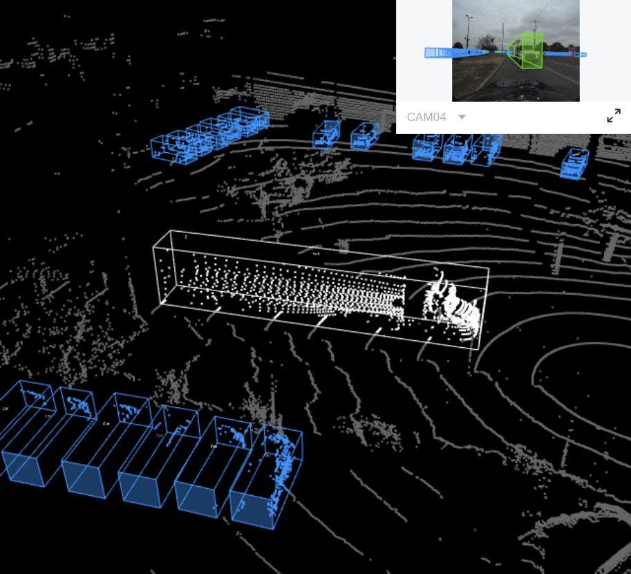

######
 CADC
######

This topic describes how to manage the "CADC" dataset.

"CADC" is a fusion dataset with 8 :ref:`sensors<advanced_features/fusion_dataset/fusion_dataset_structure:sensor>` including 7 :class:`cameras<tensorbay.sensor.sensor.Camera>` and 1 :class:`lidar<tensorbay.sensor.sensor.Lidar>`
, and has :ref:`reference/label_format:Box3D` type of labels on the point cloud data.
(:numref:`Fig. %s <example-cadc>`).
See `this page <https://gas.graviti.cn/dataset/hello-dataset/CADC>`_ for more details about this dataset.

.. _example-cadc:

   The preview of a point cloud from "CADC" with Box3D labels.

*****************************
 Authorize a Client Instance
*****************************

First of all, create a GAS client.

.. literalinclude:: ../../../../examples/CADC.py
   :language: python
   :start-after: """Authorize a Client Instance"""
   :end-before: """"""

***********************
 Create Fusion Dataset
***********************

Then, create a fusion dataset client by passing the fusion dataset name and ``is_fusion`` argument to the GAS client.

.. literalinclude:: ../../../../examples/CADC.py
   :language: python
   :start-after: """Create Fusion Dataset"""
   :end-before: """"""

********************
 List Dataset Names
********************

To check if you have created "CADC" fusion dataset, you can list all your available datasets.
See :ref:`this page <features/dataset_management:Read Dataset>` for details.

The datasets listed here include both :ref:`datasets <reference/dataset_structure:dataset>`
and :ref:`fusion datasets <advanced_features/fusion_dataset/fusion_dataset_structure:fusion dataset>`.

.. literalinclude:: ../../../../examples/CADC.py
   :language: python
   :start-after: """List Dataset Names"""
   :end-before: """"""

*************************
 Organize Fusion Dataset
*************************

Now we describe how to organize the "CADC" fusion dataset by the :class:`~tensorbay.dataset.dataset.FusionDataset`
instance before uploading it to TensorBay. It takes the following steps to organize "CADC".

Write the Catalog
=================

The first step is to write the :ref:`reference/dataset_structure:Catalog`.
Catalog is a json file contains all label information of one dataset.
See :ref:`this page <reference/dataset_structure:Catalog>` for more details.
The only annotation type for "CADC" is :ref:`reference/label_format:Box3D`, and there are 10
:ref:`reference/label_format:Category` types and 9 :ref:`reference/label_format:Attributes` types.

.. literalinclude:: ../../../../tensorbay/opendataset/CADC/catalog.json
   :language: json
   :name: cadc-catalog
   :linenos:

.. note::
   The annotations for "CADC" have tracking information, hence the value of ``isTracking`` should be set as ``True``.

Write the Dataloader
====================

The second step is to write the :ref:`reference/glossary:Dataloader`.
The :ref:`reference/glossary:Dataloader` function of "CADC" is to manage all the files and annotations of "CADC" into a
:class:`~tensorbay.dataset.dataset.FusionDataset` instance.
The :ref:`code block <cadc-dataloader>` below displays the "CADC" dataloader.

.. literalinclude:: ../../../../tensorbay/opendataset/CADC/loader.py
   :language: python
   :name: cadc-dataloader
   :linenos:
   :emphasize-lines: 16-19, 32, 33, 75, 76, 81, 87, 96, 119, 147, 145, 183, 189, 205, 208-211

create a fusion dataset
-----------------------

To load a fusion dataset, we first need to create an instance of :class:`~tensorbay.dataset.dataset.FusionDataset`.(L75)

Note that after creating the :ref:`advanced_features/fusion_dataset/fusion_dataset_structure:fusion dataset`,
you need to set the ``is_continuous`` attribute of :attr:`~tensorbay.dataset.DatasetBase.notes` to ``True``,(L76)
since the :ref:`frames<advanced_features/fusion_dataset/fusion_dataset_structure:frame>`
in each :ref:`advanced_features/fusion_dataset/fusion_dataset_structure:fusion segment` is time-continuous.

load the catalog
----------------

Same as dataset, you also need to load the :ref:`reference/dataset_structure:catalog`.(L77)
The catalog file "catalog.json" is in the same directory with dataloader file.

create fusion segments
----------------------
In this example, we create fusion segments by ``dataset.create_segment(SEGMENT_NAME)``.(L86)
We manage the data under the subfolder(L33) of the date folder(L32) into a fusion segment
and combine two folder names to form a segment name,
which is to ensure that frames in each segment are continuous.

add sensors to fusion segments
------------------------------

After constructing the fusion segment,
the :ref:`sensors<advanced_features/fusion_dataset/fusion_dataset_structure:sensor>`
corresponding to different data should be added to the fusion segment.(L87)

In "CADC" , there is a need for `projection`_,
so we need not only the name for each sensor, but also the calibration parameters.

.. _projection: https://en.wikipedia.org/wiki/3D_projection

And to manage all the :class:`~tensorbay.sensor.sensor.Sensors` (L81, L183) corresponding to different data,
the parameters from calibration files are extracted.

:class:`~tensorbay.sensor.sensor.Lidar` sensor only has :attr:`~tensorbay.sensor.sensor.Sensor.extrinsics`,
here we regard the lidar as the origin of the point cloud 3D coordinate system, and set the extrinsics as defaults(L189).

To keep the projection relationship between sensors,
we set the transform from the camera 3D coordinate system to the lidar 3D coordinate system
as :class:`~tensorbay.sensor.sensor.Camera` extrinsics(L205).

Besides :meth:`~tensorbay.sensor.sensor.Sensor.extrinsics`,
:class:`~tensorbay.sensor.sensor.Camera` sensor also has :meth:`~tensorbay.sensor.sensor.Camera.intrinsics`,
which are used to project 3D points to 2D pixels.

The intrinsics consist of two parts,
:class:`~tensorbay.sensor.intrinsics.CameraMatrix` and :class:`~tensorbay.sensor.intrinsics.DistortionCoefficients`.(L208-L211)

add frames to segment
---------------------

After adding the sensors to the fusion segments, the frames should be added into the continuous segment in order(L96).

Each frame contains the data corresponding to each sensor, and each data should be added to the frame under the key of sensor name(L147).

In fusion datasets, it is common that not all data have labels.
In "CADC", only point cloud files(Lidar data) have :ref:`reference/label_format:Box3D` type of labels(L145).
See :ref:`this page <reference/label_format:Box3D>` for more details about Box3D annotation details.

.. note::
   The :ref:`CADC dataloader <cadc-dataloader>` above uses relative import(L16-L19).
   However, when you write your own dataloader you should use regular import.
   And when you want to contribute your own dataloader, remember to use relative import.

***********************
 Upload Fusion Dataset
***********************

After you finish the :ref:`reference/glossary:Dataloader` and organize the "CADC" into a
:class:`~tensorbay.dataset.dataset.FusionDataset` instance, you can upload it
to TensorBay for sharing, reuse, etc.

.. literalinclude:: ../../../../examples/CADC.py
   :language: python
   :start-after: """Upload Fusion Dataset"""
   :end-before: """"""

Remember to execute the commit step after uploading.
If needed, you can re-upload and commit again.
Please see :ref:`this page <features/version_control:Version Control>` for more details about version control.

.. note::

   Commit operation can also be done on our GAS_ Platform.

.. _gas: https://www.graviti.cn/tensorBay

*********************
 Read Fusion Dataset
*********************

Now you can read "CADC" dataset from TensorBay.

.. literalinclude:: ../../../../examples/CADC.py
   :language: python
   :start-after: """Read Fusion Dataset / get fusion dataset"""
   :end-before: """"""

In :ref:`reference/dataset_structure:Dataset` "CADC", there are lots of
:ref:`FusionSegments <reference/dataset_structure:Segment>`: ``2018_03_06/0001``, ``2018_03_07/0001``, ...

You can get the segment names by list them all.

.. literalinclude:: ../../../../examples/CADC.py
   :language: python
   :start-after: """Read Fusion Dataset / list fusion segment names"""
   :end-before: """"""

You can get a segment by passing the required segment name.

.. literalinclude:: ../../../../examples/CADC.py
   :language: python
   :start-after: """Read Fusion Dataset / get fusion segment"""
   :end-before: """"""

.. note::

   If the :ref:`reference/dataset_structure:Segment` or
   :ref:`advanced_features/fusion_dataset/fusion_dataset_structure:fusion segment`
   is created  without given name, then its name will be "".

In the ``2018_03_06/0001`` :ref:`advanced_features/fusion_dataset/fusion_dataset_structure:fusion segment`,
there are several :ref:`sensors<advanced_features/fusion_dataset/fusion_dataset_structure:sensor>`.
You can get all the sensors by accessing the :class:`sensors<tensorbay.sensor.sensor.Sensors>`
of the :class:`~tensorbay.dataset.dataset.FusionSegment`.

.. literalinclude:: ../../../../examples/CADC.py
   :language: python
   :start-after: """Read Fusion Dataset / get sensors"""
   :end-before: """"""

In each :ref:`advanced_features/fusion_dataset/fusion_dataset_structure:fusion segment`,
there are a sequence of :ref:`frames<advanced_features/fusion_dataset/fusion_dataset_structure:frame>`.
You can get one by index.

.. literalinclude:: ../../../../examples/CADC.py
   :language: python
   :start-after: """Read Fusion Dataset / get frame"""
   :end-before: """"""

In each :ref:`advanced_features/fusion_dataset/fusion_dataset_structure:frame`,
there are several :ref:`data<advanced_features/fusion_dataset/fusion_dataset_structure:data in fusion dataset>`
corresponding to different sensors.
You can get each data by the corresponding sensor name.

.. literalinclude:: ../../../../examples/CADC.py
   :language: python
   :start-after: """Read Fusion Dataset / get data"""
   :end-before: """"""

In "CADC", only :ref:`data<advanced_features/fusion_dataset/fusion_dataset_structure:data in fusion dataset>`
under :class:`~tensorbay.sensor.sensor.Lidar`
has a sequence of :ref:`reference/label_format:Box3D` annotations.
You can get one by index.

.. literalinclude:: ../../../../examples/CADC.py
   :language: python
   :start-after: """Read Fusion Dataset / get label"""
   :end-before: """"""

There is only one label type in "CADC" dataset, which is ``box3d``.
The information stored in :ref:`reference/label_format:Category` is
one of the category names in "categories" list of :ref:`catalog.json <cadc-catalog>`.
The information stored in :ref:`reference/label_format:Attributes`
is some of the attributes in "attributes" list of :ref:`catalog.json <cadc-catalog>`.

See :ref:`this page <reference/label_format:Box3D>` for more details about the structure of Box3D.

***********************
 Delete Fusion Dataset
***********************

To delete "CADC", run the following code:

.. literalinclude:: ../../../../examples/CADC.py
   :language: python
   :start-after: """Delete Fusion Dataset"""
   :end-before: """"""
