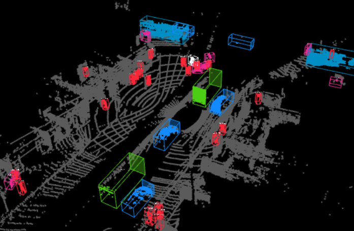

###########
 Neolix OD
###########

This topic describes how to manage the "Neolix OD" dataset.

"Neolix OD" is a dataset with :ref:`reference/label_format:Box3D` label type
(:numref:`Fig. %s <example-neolixod>`).
See `this page <https://gas.graviti.cn/dataset/beac94cf/NeolixOD>`_ for more details about this dataset.

.. _example-neolixod:

   The preview of a point cloud from "Neolix OD" with Box3D labels.

***************************
 Authorize a Client Object
***************************

First of all, create a GAS client.

.. literalinclude:: ../../../examples/NeolixOD.py
   :language: python
   :start-after: """Authorize a Client Object"""
   :end-before: """"""

****************
 Create Dataset
****************

Then, create a dataset client by passing the dataset name to the GAS client.

.. literalinclude:: ../../../examples/NeolixOD.py
   :language: python
   :start-after: """Create Dataset"""
   :end-before: """"""

********************
 List Dataset Names
********************

To check if you have created "Neolix OD" dataset, you can list all your available datasets.
See :ref:`this page <features/dataset_management:Read Dataset>` for details.

.. literalinclude:: ../../../examples/NeolixOD.py
   :language: python
   :start-after: """List Dataset Names"""
   :end-before: """"""

.. note::

   Note that method ``list_dataset_names()`` returns an iterator, use ``list()`` to transfer it to a "list".

******************
 Organize Dataset
******************

Now we describe how to organize the "Neolix OD" dataset by the :class:`~tensorbay.dataset.dataset.Dataset`
object before uploading it to TensorBay. It takes the following steps to organize "Neolix OD".

Write the Catalog
=================

The first step is to write the :ref:`reference/dataset_structure:Catalog`.
Catalog is a json file contains all label information of one dataset.
See :ref:`this page <reference/dataset_structure:Catalog>` for more details.
The only annotation type for "Neolix OD" is :ref:`reference/label_format:Box3D`, and there are 15
:ref:`reference/label_format:Category` types and 3 :ref:`reference/label_format:Attributes` types.

.. literalinclude:: ../../../tensorbay/opendataset/NeolixOD/catalog.json
   :language: json
   :name: neolixod-catalog
   :linenos:

Write the Dataloader
====================

The second step is to write the :ref:`reference/glossary:Dataloader`.
The function of :ref:`reference/glossary:Dataloader` is to read the dataset into a
:class:`~tensorbay.dataset.dataset.Dataset` object.
The :ref:`code block <neolixod-dataloader>` below displays the "Neolix OD" dataloader.

.. literalinclude:: ../../../tensorbay/opendataset/NeolixOD/loader.py
   :language: python
   :name: neolixod-dataloader
   :linenos:
   :emphasize-lines: 11-12,39

Note that after creating the :ref:`reference/dataset_structure:Dataset`,
you need to load the :ref:`reference/dataset_structure:catalog`.(L39)
The catalog file "catalog.json" is in the same directory with dataloader file.

In this example, we create segments by ``dataset.create_segment(SEGMENT_NAME)``.
You can also create a default segment without giving a specific name, then its name
will be "".

See :ref:`this page <reference/label_format:Box3D>` for more details for about Box3D annotation details.

.. note::
   The :ref:`Neolix OD dataloader <neolixod-dataloader>` above uses relative import(L11-12).
   However, when you write your own dataloader you should use regular import.
   And when you want to contribute your own dataloader, remember to use relative import.

****************
 Upload Dataset
****************

After you finish the :ref:`reference/glossary:Dataloader` and organize the "Neolix OD" into a
:class:`~tensorbay.dataset.dataset.Dataset` object, you can upload it
to TensorBay for sharing, reuse, etc.

.. literalinclude:: ../../../examples/NeolixOD.py
   :language: python
   :start-after: """Upload Dataset"""
   :end-before: """"""

Remember to execute the commit step after uploading.
If needed, you can re-upload and commit again.
Please see :ref:`this page <features/version_control:Version Control>` for more details about version control.

.. note::

   Commit operation can also be done on our GAS_ Platform.

.. _gas: https://www.graviti.cn/tensorBay

**************
 Read Dataset
**************

Now you can read "Neolix OD" dataset from TensorBay.

.. literalinclude:: ../../../examples/NeolixOD.py
   :language: python
   :start-after: """Read Dataset / get dataset"""
   :end-before: """"""

In :ref:`reference/dataset_structure:Dataset` "Neolix OD", there is one default
:ref:`Segment <reference/dataset_structure:Segment>`: ``""`` (empty string).
You can get a segment by passing the required segment name.

.. literalinclude:: ../../../examples/NeolixOD.py
   :language: python
   :start-after: """Read Dataset / get segment"""
   :end-before: """"""

In the default :ref:`reference/dataset_structure:Segment`,
there is a sequence of :ref:`reference/dataset_structure:Data`.
You can get one by index.

.. literalinclude:: ../../../examples/NeolixOD.py
   :language: python
   :start-after: """Read Dataset / get data"""
   :end-before: """"""

.. note::

   If the :ref:`reference/dataset_structure:Segment` or
   :ref:`advanced_features/fusion_dataset/fusion_dataset_structure:fusion segment`
   is created  without given name, then its name will be "".

In each :ref:`reference/dataset_structure:Data`,
there is a sequence of :ref:`reference/label_format:Box3D` annotations.
You can get one by index.

.. literalinclude:: ../../../examples/NeolixOD.py
   :language: python
   :start-after: """Read Dataset / get label"""
   :end-before: """"""

There is only one label type in "Neolix OD" dataset, which is ``box3d``.
The information stored in :ref:`reference/label_format:Category` is
one of the category names in "categories" list of :ref:`catalog.json <neolixod-catalog>`.
The information stored in :ref:`reference/label_format:Attributes`
is one of the attributes in "attributes" list of :ref:`catalog.json <neolixod-catalog>`.

See :ref:`this page <reference/label_format:Box3D>` for more details about the structure of Box3D.

****************
 Delete Dataset
****************

To delete "Neolix OD", run the following code:

.. literalinclude:: ../../../examples/NeolixOD.py
   :language: python
   :start-after: """Delete Dataset"""
   :end-before: """"""
