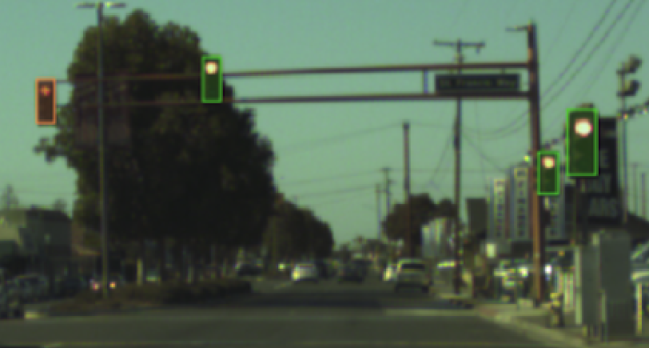

########################
 Image with Box2D Label
########################

:ref:`features:Box2D` is a kind of label type. It represents the 2D Box labels on
images. (:numref:`Fig. %s <example-Box2D>`)

.. _example-Box2D:

   The preview of an image with Box2D annotations.

*************
 Preparation
*************

First of all, create a :ref:`features:GAS Client`.

.. code:: python

    >>> from graviti import GAS

    >>> ACCESS_KEY = "Accesskey-*****"
    >>> gas = GAS(ACCESS_KEY)

*****************************
 Read Dataset from TensorBay
*****************************

As mentioned in :ref:`quick_start:Quick Start`, obtain_ and fork_ should be done before reading a
dataset from TensorBay. Then, pass the correct dataset name to the GAS client, and you will get a
:ref:`features:Dataset Client`.

Here, we take `BSTLD`_ as an example.

.. _fork: https://docs.graviti.cn/guide/opendataset/fork

.. _BSTLD: https://www.graviti.cn/open-datasets/BSTLD

.. _obtain: https://docs.graviti.cn/guide/opendataset/get

.. code:: python

   >>> dataset_client = gas.get_dataset("BSTLD")

If you are not sure about the dataset name, you can visit our `Opendataset Platform`_ to check all
"forkable" open datasets.

.. _opendataset platform: https://www.graviti.cn/open-datasets

You can use the list method to print all your forked open datasets.

.. code:: python

    >>> list(gas.list_datasets())
    ['Head Pose Image', 'TLR', 'BSTLD']

In :ref:`basic_concepts:Dataset` ``BSTLD``, there are three
:ref:`Segments <basic_concepts:Segment>`: ``train``, ``test`` and ``additional``,
you can get the segment names by list them all.

.. code::

    >>> list(dataset_client.list_segments())
    ['additional', 'test', 'train']

You can get a segment by passing the required segment name.

.. code:: python

    >>> train_segment = dataset_client.get_segment_object("train")

In the train :ref:`basic_concepts:Segment`, there is a sequence of :ref:`basic_concepts:Data`. You
can get one by index.

.. code:: python

    >>> data = train_segment[3]
    >>> data
    Data("tb:BSTLD:train://207390.png")(
     (fileuri): tb:BSTLD:train://207390.png,
     (labels): Labels(
       (box2d): [
         LabeledBox2D(612, 354.75, 615.5, 360.375)(...),
         LabeledBox2D(632.25, 346.375, 636.625, 355.375)(...),
         LabeledBox2D(649.25, 353.5, 653.875, 364.875)(...)
       ]
     )
    )

.. note::

   If the :ref:`basic_concepts:Segment` or :ref:`basic_concepts:FusionSegment` is created without
   given name, then its name will be "".

In each :ref:`basic_concepts:Data`, there is a sequence of :ref:`features:Box2D` annotations. You
can get one by index.

.. code:: python

    >>> label_box2d = data.labels.box2d[0]
    >>> label_box2d
    LabeledBox2D(612, 354.75, 615.5, 360.375)(
      (category): 'RedLeft',
      (attributes): {...},
      (instance): ''
    )
    >>> label_box2d.category
    'RedLeft'
    >>> label_box2d.attributes
    {'occluded': True}

There is only one label type in ``BSTLD`` dataset, which is ``box2d``. The annotation "RedLeft" is
stored in :ref:`features:Category` of :ref:`features:Box2D`. The annotation "{'occluded': True}"
is stored in :ref:`features:Attributes` of :ref:`features:Box2D`.

*************************
 Read Dataset from Local
*************************

If you want to read a dataset from local and there is an available :ref:`contribution:Dataloader`,
just import the dataloader function and pass the local dataset directory to it. The directory
structure for ``BSTLD`` should be like:

.. code:: console

    <path>
       rgb/
           additional/
               2015-10-05-10-52-01_bag/
                   <image_name>.jpg
                   ...
               ...
           test/
               <image_name>.jpg
               ...
           train/
               2015-05-29-15-29-39_arastradero_traffic_light_loop_bag/
                   <image_name>.jpg
                   ...
               ...
       test.yaml
       train.yaml
       additional_train.yaml

.. code:: python

    >>> from graviti.opendataset import BSTLD

    >>> dataset = BSTLD("path/to/dataset/directory")
    >>> dataset
    Dataset("BSTLD") [
      Segment("additional") [...],
      Segment("test") [...],
      Segment("train") [...],
    ]

.. note::

   Note that :ref:`basic_concepts:Dataset` and :ref:`features:Dataset Client` are different
   concepts.

.. warning::

   TensorBay dataloader works well only with the original dataset directory structure.
   Downloading datasets from either official website or `Graviti Opendatset Platform`_ is highly
   recommended.

.. _graviti opendatset platform: https://www.graviti.cn/open-datasets

TensorBay supplies two methods to fetch :ref:`basic_concepts:Segment` from
:ref:`basic_concepts:Dataset`.

.. code:: python

    >>> train_segment = dataset.get_segment_by_name("train")

    >>> first_segment = dataset[0]

The :ref:`basic_concepts:Segment` you get now is the same as the one you read from TensorBay in the
:ref:`quick_start:Read Dataset from TensorBay` part.

**************************
 Write Dataset Dataloader
**************************

If there is no :ref:`contribution:Dataloader` available to your target dataset,
you can write one and contribute it.
Now we take ``BSTLD`` as an example to explain how to write a dataloader for datasets with Box2D
labels.

Write the Catalog
=================

Before writing the dataloader, we first need to write the :ref:`contribution:Catalog`.
Catalog is a json file contains all label information of one dataset.
See :ref:`this page <basic_concepts:Catalog & SubCatalog>` for more details.
The only annotation type for ``BSTLD`` is :ref:`features:Box2D`, and there are 13
:ref:`features:Category` types and one :ref:`features:Attributes` type.

.. literalinclude:: ../../../opendataset/BSTLD/catalog.json
   :language: json
   :name: BSTLD-catalog
   :linenos:

Write the Dataloader
====================

The function of :ref:`contribution:Dataloader` is to read the dataset into a
:ref:`basic_concepts:Dataset` object.
The :ref:`code block <BSTLD-dataloader>` below displays the ``BSTLD`` dataloader.

.. literalinclude:: ../../../opendataset/BSTLD/loader.py
   :language: python
   :name: BSTLD-dataloader
   :linenos:
   :emphasize-lines: 11-12,52

There are mainly two steps to write a :ref:`contribution:Dataloader`:

-  Create a :ref:`basic_concepts:Dataset` and its relevant :ref:`Segments <basic_concepts:Segment>`.
-  Add the :ref:`basic_concepts:Data` and corresponding Labels
   to the created :ref:`Segments <basic_concepts:Segment>`.

Create Dataset and Segments
---------------------------

Note that after creating the :ref:`basic_concepts:Dataset`,
you need to load the :ref:`contribution:Catalog`.(L52)
The catalog file ``catalog.json`` is in the same directory with dataloader file.

In this example, we create segments by ``dataset.create_segment(SEGMENT_NAME)``.
You can also create a default segment without giving a specific name, then its name
will be "".

Add Data and Labels
-------------------

It takes four key substeps to add the data and the labels:

-  Creating :ref:`basic_concepts:Data` and adding content.
-  Creating :ref:`features:Box2D` and adding annotations.
-  Appending the Box2D labels to the created Data.
-  Appending the Data to the created Segment.

See :ref:`this page <features:Box2D>` for more details for about Box2D annotation details.

.. note::
   The :ref:`BSTLD dataloader <BSTLD-dataloader>` above uses relative import(L11-12).
   However, when you write your own dataloader you should use regular import as shown below.
   And when you want to contribute your own dataloader, remember to use relative import.

.. code:: python

    >>> from graviti.dataset import Data, Dataset
    >>> from graviti.label import LabeledBox2D

***********************************
 Upload Local Dataset to TensorBay
***********************************

Once you write your own :ref:`contribution:Dataloader` and read the local dataset into a
:ref:`basic_concepts:Dataset` object, you can upload it to TensorBay to share with the community.

.. code:: python

    >>> gas.create_dataset("BSTLD")
    >>> dataset_client = gas.upload_dataset_object(dataset, jobs=8, skip_uploaded_files=False)
    >>> dataset_client.commit("BSTLD")

Remember to execute the :ref:`features:Commit` step after uploading. If needed, you can re-upload
and commit again. Please see :ref:`features:Version Control` for more details.

.. note::

   Commit operation can also be done on our GAS_ Platform.

.. _gas: https://www.graviti.cn/tensorBay

Please see :ref:`contribution:Contribution` for how to contribute your dataloader.
