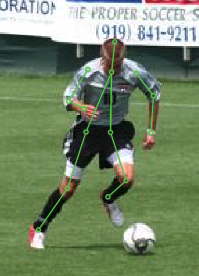

##############################
 Image with Keypoints2D Label
##############################

:ref:`supported_label_types:Keypoints2D` is a kind of label type.
It represents the 2D Keypoints labels on images. (:numref:`Fig. %s <example-Keypoints2D>`)

.. _example-Keypoints2D:

   The preview of an image with Keypoints2D annotations.

*************
 Preparation
*************

First of all, create a :ref:`features/tensorbay_client:GAS Client`.

.. code:: python

   >>> from graviti import GAS

   >>> ACCESS_KEY = "Accesskey-*****"
   >>> gas = GAS(ACCESS_KEY)

*****************************
 Read Dataset from TensorBay
*****************************

As mentioned in :ref:`quick_start:Quick Start`, obtain_ and fork_ should be done before reading a
dataset from TensorBay. Then, pass the correct dataset name to the GAS client, and you will get a
:ref:`features/tensorbay_client:Dataset Client`.

Here, we take `LeedsSportsPose`_ as an example.

.. _fork: https://docs.graviti.cn/guide/opendataset/fork

.. _LeedsSportsPose: https://www.graviti.cn/open-datasets/LeedsSportsPose

.. _obtain: https://docs.graviti.cn/guide/opendataset/get

.. code:: python

   >>> dataset_client = gas.get_dataset("LeedsSportsPose")

If you are not sure about the dataset name, you can visit our `Opendataset Platform`_ to check all
"forkable" open datasets.

.. _opendataset platform: https://www.graviti.cn/open-datasets

You can use the list method to print all your forked open datasets.

.. code:: python

   >>> list(gas.list_dataset_names())
   ['Head Pose Image', 'THCHS-30', 'LeedsSportsPose']

In :ref:`basic_concepts:Dataset` ``LeedsSportsPose``, there is one default
:ref:`basic_concepts:Segment` ``""`` (empty string). You can get it by passing the segment name.

.. code:: python

   >>> from tensorbay.dataset import Segment
   >>> default_segment = Segment("", dataset_client)

In the default :ref:`basic_concepts:Segment`, there is a sequence of :ref:`basic_concepts:Data`. You
can get one by index.

.. code:: python

    >>> data = default_segment[0]
    >>> data
    Data("tb:LeedsSportsPose:://im0001.jpg")(
      (fileuri): tb:LeedsSportsPose:://im0001.jpg,
      (labels): Labels(
        (keypoints2d): [
          LabeledKeypoints2D [...]()
        ]
      )
    )

.. note::

   If the :ref:`basic_concepts:segment` or
   :ref:`advanced_features/fusion_dataset/concepts:fusion segment` is created without
   given name, then its name will be "".

In each :ref:`basic_concepts:Data`, there is a sequence of :ref:`supported_label_types:Keypoints2D` annotations.
You can get one by index.

.. code:: python

    >>> label_keypoints2d = data.label.keypoints2d[0]
    >>> label_keypoints2d
    LabeledKeypoints2D [
      Keypoint2D(29.74645940655481, 143.34544031478885, 1),
      Keypoint2D(30.550106796871408, 117.22690012949823, 1),
      Keypoint2D(28.942812016238122, 84.67918082167456, 1),
      Keypoint2D(43.00664134677925, 85.08100451683288, 1),
      Keypoint2D(42.20299395646262, 111.19954470212348, 1),
      Keypoint2D(42.604817651620905, 132.89802424067258, 1),
      Keypoint2D(24.522751369496643, 52.93510890416752, 1),
      Keypoint2D(15.28080638085534, 62.980701283125455, 1),
      Keypoint2D(24.12092767433833, 42.08586913489297, 1),
      Keypoint2D(50.64129155478724, 44.094987610684534, 1),
      Keypoint2D(52.65041003057883, 58.962464331542286, 1),
      Keypoint2D(53.8558811160538, 58.962464331542286, 1),
      Keypoint2D(38.18475700487942, 36.0585137075182, 1),
      Keypoint2D(38.98840439519605, 15.565505254444032, 1)
    ]()

There is only one label type in ``LeedsSportsPose`` dataset, which is ``keypoints2d``.

*************************
 Read Dataset from Local
*************************

If you want to read a dataset from local and there is an available :ref:`contribution:Dataloader`,
just import the dataloader function and pass the local dataset directory to it. The directory
structure for ``LeedsSportsPose`` should be like:

.. code:: console

    <path>
        joints.mat
        images/
            im0001.jpg
            im0002.jpg
            ...

.. code:: python

    >>> from graviti.opendataset import LeedsSportsPose

    >>> dataset = LeedsSportsPose("path/to/dataset/directory")
    >>> dataset
    Dataset("LeedsSportsPose") [
      Segment("") [...]
    ]

.. note::

   Note that :ref:`basic_concepts:Dataset` and :ref:`features/tensorbay_client:Dataset Client`
   are different concepts.

.. warning::

   TensorBay dataloader works well only with the original dataset directory structure.
   Downloading datasets from either official website or `Graviti Opendatset Platform`_ is highly
   recommended.

.. _graviti opendatset platform: https://www.graviti.cn/open-datasets

TensorBay supplies two methods to fetch :ref:`basic_concepts:Segment` from
:ref:`basic_concepts:Dataset`.

.. code:: python

   >>> default_segment = dataset.get_segment_by_name("")

   >>> first_segment = dataset[0]

The :ref:`basic_concepts:Segment` you get now is the same as the one you read from TensorBay in the
:ref:`quick_start:Read Dataset from TensorBay` part.

**************************
 Write Dataset Dataloader
**************************

If there is no :ref:`contribution:Dataloader` available to your target dataset,
you can write one and contribute it.
Now we take ``LeedsSportsPose`` as an example to explain how to write a dataloader
for datasets with keypoints2d labels.

Write the Catalog
=================

Before writing the dataloader, we first need to write the :ref:`contribution:Catalog`.
Catalog is a json file contains all label information of one dataset.
See :ref:`this page <basic_concepts:Catalog & SubCatalog>` for more details.
The only annotation type for ``LeedsSportsPose`` is :ref:`supported_label_types:Keypoints2D`.

.. literalinclude:: ../../../tensorbay/opendataset/LeedsSportsPose/catalog.json
   :language: json
   :name: LeedsSportsPose-catalog
   :linenos:

Write the Dataloader
====================

The function of :ref:`contribution:Dataloader` is to read the dataset into a
:ref:`basic_concepts:Dataset` object.
The :ref:`code block <LeedsSportsPose-dataloader>` below displays
the ``LeedsSportsPose`` dataloader.

.. literalinclude:: ../../../tensorbay/opendataset/LeedsSportsPose/loader.py
   :language: python
   :name: LeedsSportsPose-dataloader
   :linenos:
   :emphasize-lines: 11-14,37

There are mainly two steps to write a :ref:`contribution:Dataloader`:

-  Create a :ref:`basic_concepts:Dataset` and its relevant :ref:`Segments <basic_concepts:Segment>`.
-  Add the :ref:`basic_concepts:Data` and corresponding Labels
   to the created :ref:`Segments <basic_concepts:Segment>`.

Create Dataset and Segments
---------------------------

Note that after creating the :ref:`basic_concepts:Dataset`,
you need to load the :ref:`contribution:Catalog`.(L37)
The catalog file ``catalog.json`` is in the same directory with dataloader file.

In this example, we create a default segment without giving a specific name.
You can also create a segment by ``dataset.create_segment(SEGMENT_NAME)``.

Add Data and Labels
-------------------

It takes four key substeps to add the data and the labels:

-  Creating :ref:`basic_concepts:Data` and adding content.
-  Creating :ref:`supported_label_types:Keypoints2D` and adding annotations.
-  Appending the Keypoints2D labels to the created Data.
-  Appending the Data to the created Segment.

See :ref:`this page <supported_label_types:Keypoints2D>` for more details
for about Keypoints2D annotation details.

.. note::

   The :ref:`LeedsSportsPose dataloader <LeedsSportsPose-dataloader>`
   above uses relative import(L11-14). However, when you write your
   own dataloader you should use regular import as shown below.
   And when you want to contribute your own dataloader, remember to use relative import.

.. code:: python

    >>> from graviti.dataset import Data, Dataset
    >>> from graviti.geometry import Keypoint2D
    >>> from graviti.label import LabeledKeypoints2D

***********************************
 Upload Local Dataset to TensorBay
***********************************

Once you write your own :ref:`contribution:Dataloader` and read the local dataset into a
:ref:`basic_concepts:Dataset` object, you can upload it to TensorBay to share with the community.

.. code:: python

    >>> gas.create_dataset("LeedsSportsPose")
    >>> dataset_client = gas.upload_dataset(dataset, jobs=8, skip_uploaded_files=False)
    >>> dataset_client.commit("LeedsSportsPose")

Remember to execute the :ref:`features/version_control:Commit` step after uploading.
If needed, you can re-upload and commit again.
Please see :ref:`features/version_control:Version Control` for more details.

.. note::

   Commit operation can also be done on our GAS_ Platform.

.. _gas: https://www.graviti.cn/tensorBay

Please see :ref:`contribution:Contribution` for how to contribute your dataloader.
