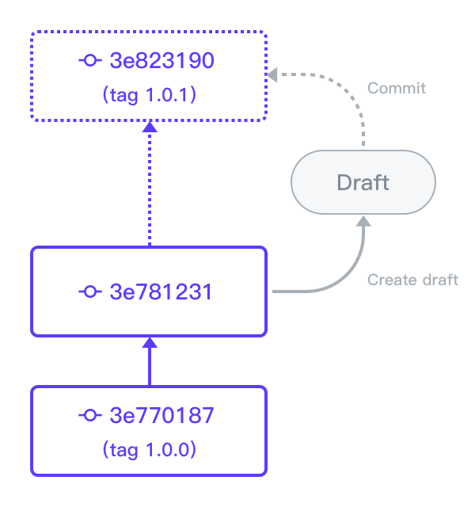

#################
 Version Control
#################

TensorBay currently supports the linear version control.
A new version of a dataset can be built upon the previous version.
:numref:`Figure. %s <version_control>` demonstrates the relations
between different versions of a dataset.

.. _version_control:

   The relations between different versions of a dataset.

.. toctree::
   :maxdepth: 1

   ../version_control/checkout
   ../version_control/create_draft_and_commit
