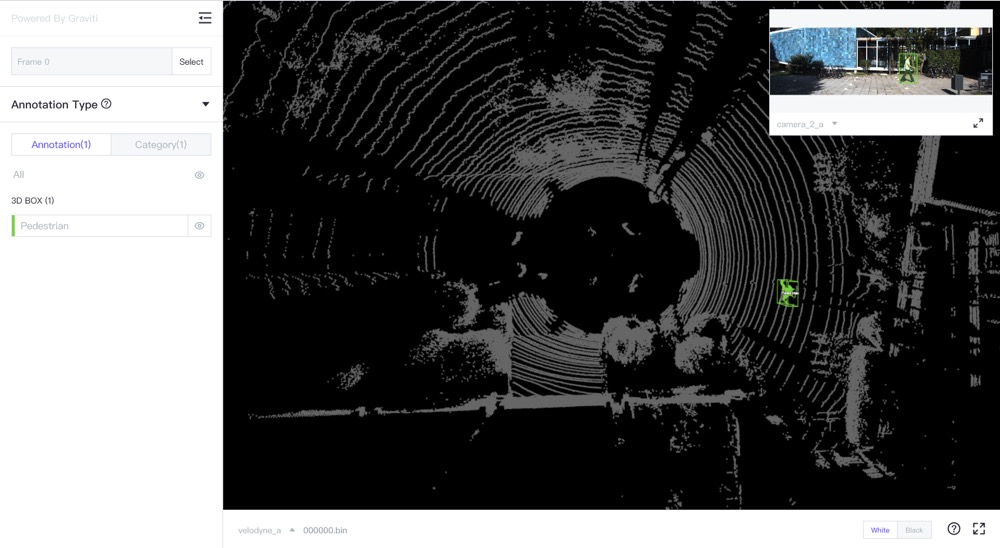

###############
 Visualization
###############

“Pharos” is a TensorBay SDK plug-in, it supports the local visualization of datasets.

***************
Install Pharos
***************

To install Pharos plug-in by **pip**, run the following command:

.. code:: console

   $ pip3 install pharos

**************
 Pharos Usage
**************

Organize a Dataset
==================

.. literalinclude:: ../../../examples/pharos.py
      :language: python
      :start-after: """Organize a Dataset"""
      :end-before: """"""

Visualize the Dataset
======================

.. literalinclude:: ../../../examples/pharos.py
      :language: python
      :start-after: """Visualize The Dataset"""
      :end-before: """"""

.. _visualization result:

   The visualized result of the KITTI-object dataset using Pharos.