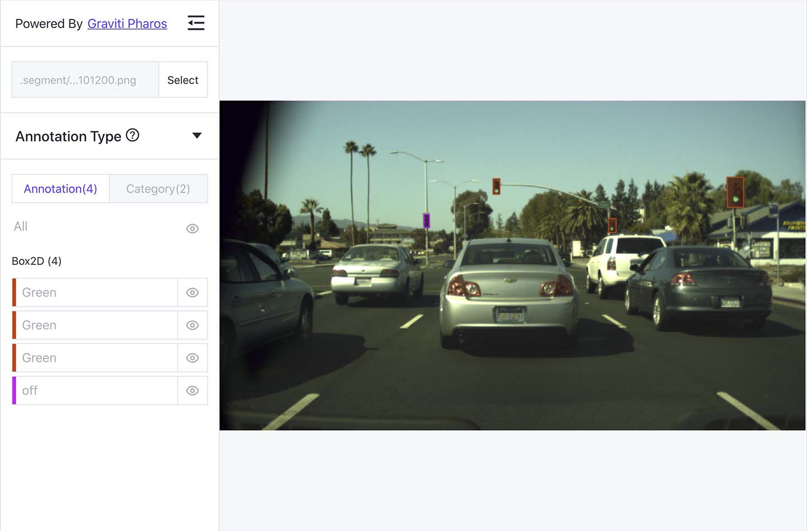

###############
 Visualization
###############

**Pharos** is a plug-in of TensorBay SDK used for local visualization.
After finishing the :ref:`dataset organization <features/dataset_management:Organize Dataset>`,
users can visualize the organized :class:`~tensorbay.dataset.dataset.Dataset` instance locally using **Pharos**.
The visualization result can help users to check whether the dataset is correctly organized.

***************
Install Pharos
***************

To install **Pharos** by **pip**, run the following command:

.. code:: console

   $ pip3 install pharos

**************
 Pharos Usage
**************

Organize a Dataset
==================

Take the :ref:`BSTLD <examples/BSTLD:Organize Dataset>` as an example:

.. literalinclude:: ../../../docs/code/pharos.py
      :language: python
      :start-after: """Organize a Dataset"""
      :end-before: """"""

Visualize the Dataset
======================

.. literalinclude:: ../../../docs/code/pharos.py
      :language: python
      :start-after: """Visualize The Dataset"""
      :end-before: """"""

Open the returned URL to see the visualization result.

.. _visualization result:

   The visualized result of the BSTLD dataset.
