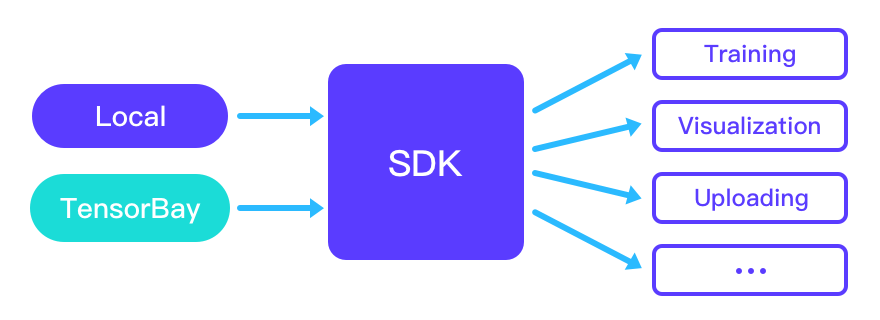

#############
 Quick Start
#############

**************
 Installation
**************

To install TensorBaySDK using ``PyPI``, run

.. code:: shell

   pip3 install graviti

*********************************
 Registration and Identification
*********************************

All TensorBay cloud services require an account. For example, an AccessKey_ is needed for
identification when using :ref:`quick_start:Read Dataset from TensorBay`. Without registration,
users can only receive local services, such as :ref:`quick_start:Read Dataset from Local`.

Please visit `Graviti AI Service(GAS)`_ to sign up.

.. _accesskey: https://gas.graviti.cn/access-key

.. _graviti ai service(gas): https://www.graviti.cn/tensorBay

************
 GAS Client
************

First step to use TensorBay is to create a :ref:`features/tensorbay_client:GAS Client`.

.. code:: python

   >>> from graviti import GAS

   >>> ACCESS_KEY = "Accesskey-*****"
   >>> gas = GAS(ACCESS_KEY)

*****************************
 Two Methods Using TensorBay
*****************************

TensorBay provides two methods to connect datasets with your model(see figure below):

-  :ref:`quick_start:Read Dataset from TensorBay`.
-  :ref:`quick_start:Read Dataset from Local`.

Read Dataset from TensorBay
===========================

In the first method, you can read a dataset uploaded by the community, your workmates, or yourself.

Before reading a dataset from TensorBay, two preparation steps should be done: obtain_ and fork_.
After that, you only need to pass the correct dataset name to the GAS client, and you will get a
:ref:`features/tensorbay_client:Dataset Client`.

Here, we take `Dogs vs. Cats`_ as an example.

.. _dogs vs. cats: https://www.graviti.cn/open-datasets/DogsVsCats

.. _fork: https://docs.graviti.cn/guide/opendataset/fork

.. _obtain: https://docs.graviti.cn/guide/opendataset/get

.. code:: python

   >>> dataset_client = gas.get_dataset( "Dogs vs. Cats")

If you are not sure about the dataset name, you can visit our `Opendataset Platform`_ to check all
"forkable" open datasets. The list method can print all your forked open datasets.

.. _opendataset platform: https://www.graviti.cn/open-datasets

.. code:: python

   >>> gas.list_dataset_names()
   ['Dogs vs. Cats', 'nuScenes']

In :ref:`basic_concepts:Dataset` ``Dogs vs. Cats``, there are two :ref:`basic_concepts:Segment`:
``train`` and ``test``, you can get all of them by list method or get one by segment name.

.. code:: python

   >>> dataset_client.list_segment_names()
   ['test', 'train']
   >>> train_segment = dataset_client.get_segment_object("train")

In each :ref:`basic_concepts:Segment`, there is a sequence of :ref:`basic_concepts:Data`. You can
get a Data object by index.

.. code:: python

   >>> from PIL import Image

   >>> data = train_segment[0]
   >>> data
   Data("tb:Dogs vs. Cats:train://cat.10.jpg") {
     <LabelType.CLASSIFICATION: 'labels_classification'>: Classification(
       (category): 'cat',
       (attributes): None,
       (instance): None
     )
   }
   >>> data.labels.classification.category
   'cat'
   >>> image = Image.open(data.open())
   >>> image.format
   JPEG
   >>> image.size
   (489, 499)
   >>> image.show()  # display image

.. note::

   :meth:`~graviti.dataset.data.Data.open()` returns a file pointer.

There is only one label type in ``Dogs vs. Cats`` dataset, which is classification. The annotation
"cat" is stored in :ref:`supported_label_types:Category` attribute of
:ref:`supported_label_types:Classification`. See
:ref:`supported_label_types:Supported Label Types` for more label information.

Read Dataset from Local
=======================

In the second manner, you can use the dataloaders contributed by community.

If you want to read a dataset from local and there is an available :ref:`contribution:Dataloader`,
just import the dataloader function and pass the local dataset directory. The directory structure
for ``Dogs vs. Cats`` should be like:

.. code:: shell

   <path>
     train/
       cat.0.jpg
       ...
       dog.0.jpg
       ...
     test/
       1000.jpg
       1001.jpg
       ...

.. code:: python

   >>> from graviti.opendataset import DogsVsCats

   >>> dataset = DogsVsCats("path/to/dataset/directory")
   >>> dataset
   Dataset("Dogs vs. Cats") [
     Segment("test") [...],
     Segment("train") [...]
   ]

.. note::

   Note that ``DogsVsCats`` is not the name, but the :ref:`contribution:identifier` of the dataset
   "Dogs vs. Cats". See :ref:`contribution:Contribution` for more details.

.. note::

   Note that :ref:`basic_concepts:Dataset` and :ref:`features/tensorbay_client:Dataset Client`
   are different concepts.

.. warning::

   TensorBay dataloader works well only with the original dataset directory structure. Downloading
   datasets from either official website or `Graviti Opendatset Platform`_ is highly recommended.

.. _graviti opendatset platform: https://www.graviti.cn/open-datasets

From the print result, we know that there are two Segments in the Dataset. TensorBay supplies two
methods to fetch :ref:`basic_concepts:Segment` from Dataset.

.. code:: python

   >>> train_segment = dataset.get_segment_by_name("train")

   >>> first_segment = dataset[0]

The Segment you get now is the same as the one you read from TensorBay in :ref:`quick_start:Read
Dataset from TensorBay`.

***********************************
 Upload Local Dataset to TensorBay
***********************************

If there is no dataloader avaliable to your target dataset, you can write one and contribute it.
Please see :ref:`contribution:Contribute Dataloader` for more details.

What's more, after you read a local dataset into a :ref:`basic_concepts:Dataset` object using your
own dataloader, you can upload it to TensorBay for reuse and sharing.
Of course, it depends on you whether to share it or not.
Please see :ref:`contribution:Contribute Dataset` for more details.

.. code:: python

   >>> dataset_client = gas.upload_dataset_object(dataset)
   >>> dataset_client.commit("a demo dataset")

Remember to do the :ref:`features/version_control:Commit` step after uploading.
If needed, you can do some operations based on this dataset and commit again.

.. code:: python

   >>> dataset_client.upload_segment_object(segment)
   >>> dataset_client.commit("add a new segment")

Please see :ref:`features/version_control:Version Control` for more details.
